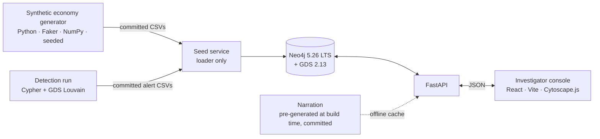
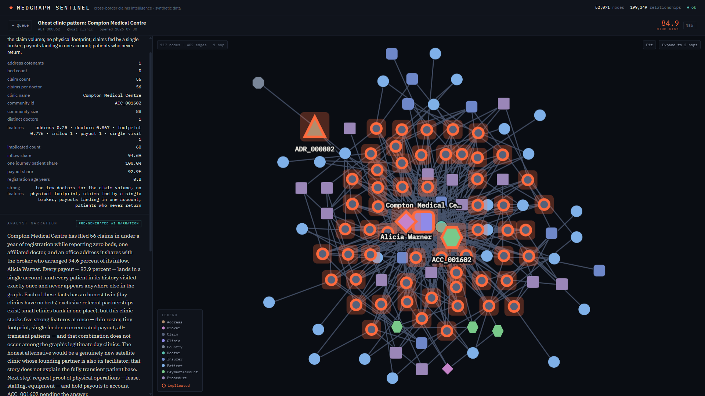
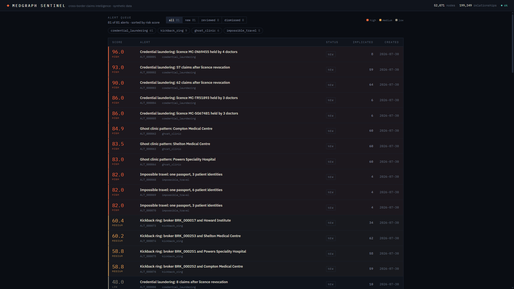

# MedGraph Sentinel

**Cross-border medical fraud is a network. This is the tool that sees the
network.**

In medical tourism, one patient journey touches five record-keepers — home
country, treating country, insurer, broker, accreditor — and no one of them
sees the whole chain. Organised fraud is engineered so every individual
record looks fine; the pattern only appears when records are connected
across organisations. MedGraph Sentinel builds that connected graph, detects
structurally suspicious subgraphs with graph algorithms, and explains each
finding to a human investigator in plain English.

> **All data in this repository is synthetic.** Real countries and real
> procedure categories; every person, clinic, broker, insurer, identifier,
> and claim is generated fiction (seeded, reproducible). No real patient
> data was used, anywhere, at any point.

## What it does

- **Entity graph** — 52,071 nodes / 199,349 relationships (patients, doctors,
  clinics, brokers, claims, credentials, payment accounts, devices,
  addresses) in Neo4j, spanning five real medical-tourism corridors.
- **Four detection typologies** — ghost clinics, credential laundering,
  kickback rings, impossible travel — via Neo4j GDS (Louvain community
  detection) and targeted Cypher, producing **81 scored, explainable
  alerts**. Global centrality was benchmarked for the kickback rule and
  dropped: a one-line concentration share ranked the true steering brokers
  better, at up to 10⁶× less compute (ADR-028). Two more typologies
  (template cloning, circular payments) are fully specified with
  false-positive modes as the next build
  ([DETECTION_SPEC](docs/DETECTION_SPEC.md), ADR-024).
- **Investigator console** — alert queue → evidence subgraph → plain-English
  narration → review workflow. Never a 50k-node hairball; always the
  drill-down.

## What the evaluation actually showed

Two evaluations, both reported as they landed.

**Dev set (planted fraud, frozen rules, nothing tuned after the fact —
ADR-031):** planted ghost/credential cells 3/3 caught at `high` on *both*
typologies 1 and 2; impossible-passport groups 3/3 at `high`; the kickback
rule caught 6 of 13 steering brokers — the misses are all
sub-median-volume steerers. The honest economy produces **zero medium+
alerts on every rule**, which is what makes the low-severity tail
interpretable as the documented noise floor rather than as failure.

**Held-out set (one shot, pre-registered — ADR-034):** five scenarios were
authored and SHA-256-committed on 2026-07-30 *before any detection query
existed*, then opened once, after the rules were frozen and after a
pre-registration commit promising no tuning on the results.

**5 scenarios · 8 detection legs expected · 5 detected · 3 missed · 2
distinct root causes.** All 5 scenarios raised at least one alert, but 3
of the 8 expected legs did not fire. Both root causes are limitations in
the rules, not accidents:

- **Composed false-positive guards (accounts for 2 of the 3 misses — S2
  and S5 credential legs):** shared licence numbers are only counted
  within one issuing body, and post-revocation billing is suppressed when
  the doctor holds another valid credential. Each guard is individually
  justified by the honest data; composed, they leave a gap that a
  cross-jurisdiction licence held by a doctor with one valid credential
  passes straight through.
- **Conservative travel matrix (accounts for the 3rd miss — S5 travel
  leg):** the rule flags only the physically impossible (same-day
  treatment in two countries), so the scenario's 2–26 day gaps pass
  unflagged. That conservatism is also why it produces zero medium-or-high
  false positives across 10,000 honest patients.

Both fixes are specified as next-build. Neither was applied — applying them
would have broken the pre-registration, which is the only thing that makes
the number worth anything.

**What the protocol proves and does not prove:** the hashes and git history
fix the *ordering* — scenarios predate every detection query, rules were
frozen before the scenarios were reopened. They do **not** prove
independence: one person conceived the scenarios, the data model, and the
rules, and no hash can separate what one brain knew. Nor do they prove
real-world generalization or generator realism. Details:
[HELDOUT_COMMITMENT](docs/HELDOUT_COMMITMENT.md), ADR-034.

## Architecture



Detection and narration both happen **before** the repo is published; what
ships is their output. Everything a clone runs is local and offline.

## Quickstart (3 minutes after image pull)

```bash
git clone https://github.com/Don-Gabriel/medgraph-sentinel.git
cd medgraph-sentinel
cp .env.example .env   # set NEO4J_PASSWORD; no API key required
docker compose up -d
```

Then open **http://localhost:5173** — you land on a live queue of 81 alerts.
The seed service runs the **loader only**: the alerts are committed CSV data
loaded like any other file (ADR-029), so every clone boots in *load* time,
never detection time, and `docker compose down -v && docker compose up -d`
reproduces the identical 81-alert queue. `/api/v1/health` should report
`"status":"ok"` and `narration_cache.match: true`.

**No API key is required, ever.** Every narration was generated once at
build time and committed to `api/narration_cache/` (ADR-032); the console
labels them "pre-generated AI narration" and falls back to a deterministic
template if a cache entry is ever missing. The whole stack runs air-gapped
— which is how it gets demoed.

## Screenshots

Captured from the running console (1920×1080). Full click path:
[`screenshot-deck/`](screenshot-deck/).

**Evidence subgraph + narration** — the ghost-clinic finding: implicated
nodes carry the ember halo, everything else is context.



**Alert queue** — severity as a heat ramp, every count also a filter.



## Read the docs

The documentation is the design — start here:

| doc | what it is |
|---|---|
| [PROJECT_BRIEF](docs/PROJECT_BRIEF.md) | the problem and the insight, in 90 seconds |
| [DATA_MODEL](docs/DATA_MODEL.md) | every node, edge, constraint, index — and why |
| [DETECTION_SPEC](docs/DETECTION_SPEC.md) | the typologies (4 shipping + 2 specified next) incl. their false-positive modes |
| [DATA_GENERATION](docs/DATA_GENERATION.md) | the synthetic economy; emergent vs planted fraud; the held-out protocol |
| [INTERFACES](docs/INTERFACES.md) | the module contracts that keep the seams explainable and Day-2 extensible |
| [DECISIONS](docs/DECISIONS.md) | the ADR log — every choice, alternatives, rationale |

## Team

Hazzino Technologies State-Level Mega Hackathon 2026 — Theni, Tamil Nadu.

Built solo by **J Don Gabriel**
([@Don-Gabriel](https://github.com/Don-Gabriel)) — originally planned as a
five-person team; the re-planning is on the record in
[docs/DECISIONS.md](docs/DECISIONS.md) (ADR-024, ADR-027). Every module is
explainable by the one person you can point at; the question drill sheet is
[docs/DEFENCE_AREAS.md](docs/DEFENCE_AREAS.md).

## How this was built

AI-assisted throughout — disclosed here, once, rather than sprinkled through
commit trailers. That changes nothing about the bar: the explain-aloud rule
in [CONTRIBUTING.md](CONTRIBUTING.md) says no code ships that cannot be
explained aloud, unaided. This is a solo build (ADR-027), so there is
exactly one person to ask, and no module he can point somewhere else for.

## License

[MIT](LICENSE)
