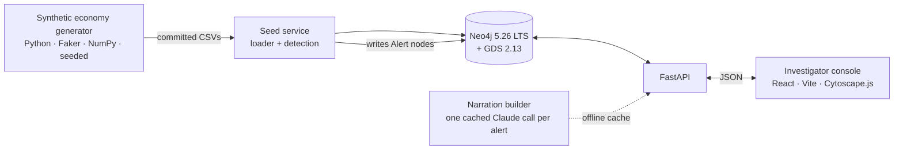

# MedGraph Sentinel

**Cross-border medical fraud is a network. This is the tool that sees the
network.**

In medical tourism, one patient journey touches five record-keepers — home
country, treating country, insurer, broker, accreditor — and no one of them
sees the whole chain. Organised fraud is engineered so every individual
record looks fine; the pattern only appears when records are connected
across organisations. MedGraph Sentinel builds that connected graph, detects
structurally suspicious subgraphs with graph algorithms, and explains each
finding to a human investigator in plain English.

> **All data in this repository is synthetic.** Real countries and real
> procedure categories; every person, clinic, broker, insurer, identifier,
> and claim is generated fiction (seeded, reproducible). No real patient
> data was used, anywhere, at any point.

## What it does

- **Entity graph** — ~50,000 nodes (patients, doctors, clinics, brokers,
  claims, credentials, payment accounts, devices, addresses) in Neo4j,
  spanning five real medical-tourism corridors.
- **Four detection typologies** — ghost clinics, credential laundering,
  kickback rings, impossible travel — via Neo4j GDS algorithms (Louvain,
  PageRank, betweenness) and targeted Cypher, producing scored, explainable
  alerts. Two more (template cloning, circular payments) are fully
  specified with false-positive modes as the next build
  ([DETECTION_SPEC](docs/DETECTION_SPEC.md), ADR-024).
- **Investigator console** — alert queue → evidence subgraph → plain-English
  narration → review workflow. Never a 50k-node hairball; always the
  drill-down.

## Architecture



Everything runs locally and offline; the LLM narration is pre-computed and
committed, with a deterministic fallback.

## Quickstart (3 minutes after image pull)

```bash
git clone https://github.com/Don-Gabriel/medgraph-sentinel.git
cd medgraph-sentinel
cp .env.example .env   # set NEO4J_PASSWORD; no API key required
docker compose up
```

Then open **http://localhost:5173**. The seed service loads the committed
dataset and runs detection automatically — you land on a live alert queue.
*(Build phase in progress: `docker-compose.yml` and source land per
[docs/MILESTONES.md](docs/MILESTONES.md); the planning docs below are
complete.)*

## Screenshots

*(Placeholder — captured at the Aug 10 dress rehearsal.)*

| Alert queue | Evidence subgraph + narration |
|---|---|
| _coming_ | _coming_ |

## Read the docs

The documentation is the design — start here:

| doc | what it is |
|---|---|
| [PROJECT_BRIEF](docs/PROJECT_BRIEF.md) | the problem and the insight, in 90 seconds |
| [DATA_MODEL](docs/DATA_MODEL.md) | every node, edge, constraint, index — and why |
| [DETECTION_SPEC](docs/DETECTION_SPEC.md) | the typologies (4 shipping + 2 specified next) incl. their false-positive modes |
| [DATA_GENERATION](docs/DATA_GENERATION.md) | the synthetic economy; emergent vs planted fraud; the held-out protocol |
| [INTERFACES](docs/INTERFACES.md) | the module contracts that let five people build in parallel |
| [DECISIONS](docs/DECISIONS.md) | the ADR log — every choice, alternatives, rationale |

## Team

Hazzino Technologies State-Level Mega Hackathon 2026 — Theni, Tamil Nadu.

| | |
|---|---|
| J Don Gabriel (lead) | [@Don-Gabriel](https://github.com/Don-Gabriel) |
| Vijayalakshmi G | `<handle-tbd>` |
| Mary Vivitha M | `<handle-tbd>` |
| Poonkundran R | `<handle-tbd>` |
| Pavithra R | `<handle-tbd>` |

Roles are deliberately fluid — everyone builds everywhere; see
[docs/DEFENCE_AREAS.md](docs/DEFENCE_AREAS.md) for who answers what.

## How this was built

Built with AI assistance; every module is owned and defensible by a named
team member — the bar is the explain-aloud rule in
[CONTRIBUTING.md](CONTRIBUTING.md).

## License

[MIT](LICENSE)
